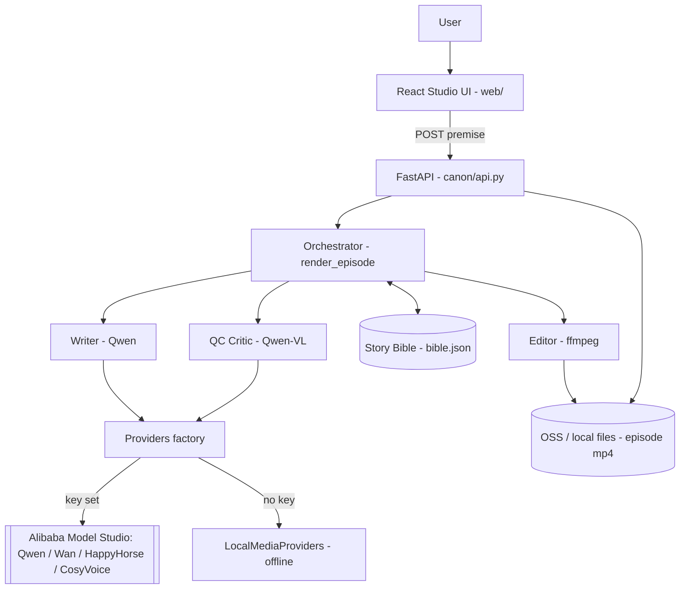
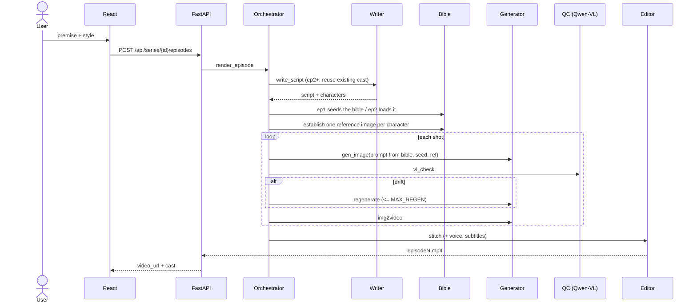

# Canon — Architecture

## System



Every external model call sits behind the `Providers` interface. `get_providers()` returns `DashScopeProviders` when `DASHSCOPE_API_KEY` is set, otherwise `LocalMediaProviders`, so the whole system runs and is fully tested offline with zero credits.

## Data flow (one episode)



## Data model

No relational DB. The datastore is a per-series directory:

```
canon/data/series/<id>/
  bible.json          {style, characters:{name:{descriptor, seed, ref_image}}}
  refs/<slug>_<seed>.png    canonical character reference (locks the look)
  work_ep<n>/         intermediate shot pngs + mp4s
  episode<n>.mp4      the finished episode
```

`bible.json` is the single source of truth. Episode 2's consistency = it loads this file instead of rewriting it.

## The critical trade-off: consistency

| | **A: descriptor + reference + fixed seed + QC loop** (chosen) | **B: per-character LoRA / fine-tune** |
|---|---|---|
| Consistency | good, occasional drift | excellent |
| Build time | hours | days |
| Infra | none beyond API | GPU training pipeline |
| Iteration | edit a string | retrain |
| Fits the timeline | yes | no |

**A.** It reaches most of B's consistency for a fraction of the effort, keeps a live knob, and turns residual drift into an on-camera feature: the QC critic catching and fixing itself.

## Security boundaries

- **Path traversal:** model-supplied character names are slugged before becoming filenames; shot files key off the integer shot index; the API validates `series_id` against `^[a-z0-9-]{1,40}$` before any filesystem use.
- **Subprocess:** every ffmpeg call is an argument list (never `shell=True`); subtitle/dialogue text lives in an `.srt` data file, never on the command line.
- **Downloads:** model-returned asset URLs are fetched https-only and size-capped.
- **Secrets:** the API key is read from the environment, never committed (`.env` is gitignored).

## Top failure modes

1. **Model API / credits** — backoff, cache shots by `hash(prompt, seed)`, cap regen, pre-generate demo assets, fallback model id via env.
2. **Consistency miss** — the QC loop, a human review gate before recording, stylized aesthetic, seed + reference locking.
3. **Demo-day environment** — the demo is pre-recorded, assets on OSS, the app is stateless and redeployable.
